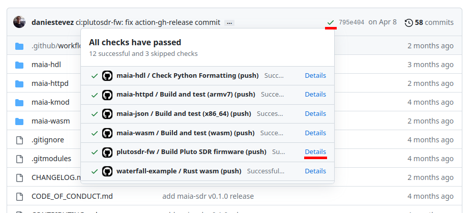
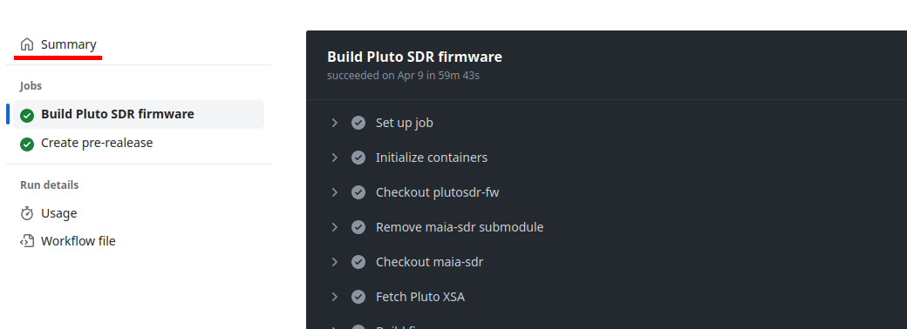
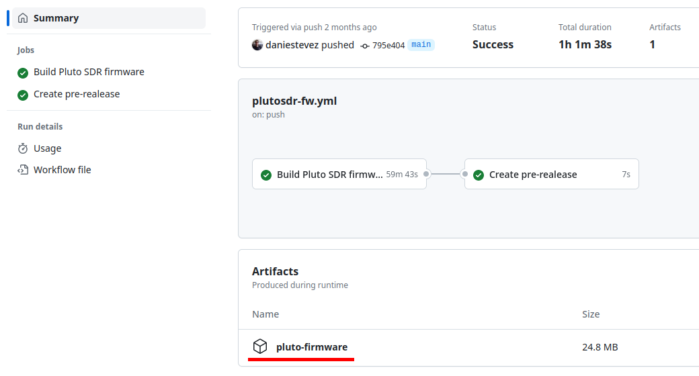

# Maia SDR

[Maia SDR](https://maia-sdr.org) is an open-source FPGA-based SDR project focusing on the [ADALM
Pluto](https://www.analog.com/en/design-center/evaluation-hardware-and-software/evaluation-boards-kits/adalm-pluto.html).

It currently provides a firmware image for the Pluto with the following functionality:
* Web-based interface that can be accessed from a smartphone, PC or other device.
* Real-time waterfall display supporting up to 61.44 Msps (limit given by the
AD936x RFIC of the Pluto).
* IQ recording in [SigMF format](https://github.com/gnuradio/SigMF), at up to
61.44 Msps and with a 400 MiB maximum data size (limit given by the Pluto RAM
size). Recordings can be downloaded to a smartphone or other device.

See [maia-sdr.org](https://maia-sdr.org) for more details.

## Firmware images

Stable releases of firmware images for the ADALM Pluto can be found in the
[plutosdr-fw](https://github.com/maia-sdr/plutosdr-fw) repository. See also the
[installation instructions](https://maia-sdr.org/installation/).

Experimental ADALM Pluto firmware images are built automatically with Github's
actions system. To download the firmware image for the latest commit in the
`main` branch (or for any other commit), click on the actions check, then go to
the `plutosdr-fw` action details, click on the summary, and download the
`pluto-firmware` artifact. This procedure is illustrated by the following
screenshots.

For each pull request, a firmware image is also built. The bot adds a comment to
the pull request with a link to the firmware when it is ready.

Note that the process for building firmware images with Github actions is
currently experimental and that the FPGA image is not built, because it is not
possible to run Vivado in a Github-hosted runner. The actions system will take
the latest XSA file published as an asset in a maia-sdr release. This may or may
not work with the current state of the `main` branch or a particular pull
request. The main goal of this system is to allow people to preview and test new
features before they make it into stable releases.

## Support

Support for Maia SDR is handled through
[Github issues](https://github.com/maia-sdr/maia-sdr/issues)
and
[Github discussions](https://github.com/maia-sdr/maia-sdr/discussions).

## Project structure

The project is divided into the following components:

* [maia-hdl](maia-hdl). The FPGA design. It is written in
  [Amaranth](https://github.com/amaranth-lang/amaranth). It can be used to build
  the Vivado project and bitstream for Maia SDR or as a library in other projects.
* [maia-httpd](maia-httpd). The software application that runs on the Zynq ARM CPU.
  It is written in asynchronous Rust and spawns a web server.
* [maia-kmod](maia-kmod). A kernel module used to control some RAM buffers that
  are used to exchange data between the FPGA and CPU.
* [maia-wasm](maia-wasm). A web application that is the UI of Maia SDR. IT is
  written in Rust with WebAssembly and uses WebGL2 to render the waterfall.

## License

maia-hdl is licensed under the
[MIT license](http://opensource.org/licenses/MIT). maia-httpd and maia-wasm are
licensed under either of the
[Apache License, Version 2.0](http://www.apache.org/licenses/LICENSE-2.0)
or the MIT license at your option. maia-kmod is licensed under the
[GPL, version 2](https://www.gnu.org/licenses/old-licenses/gpl-2.0.en.html).

